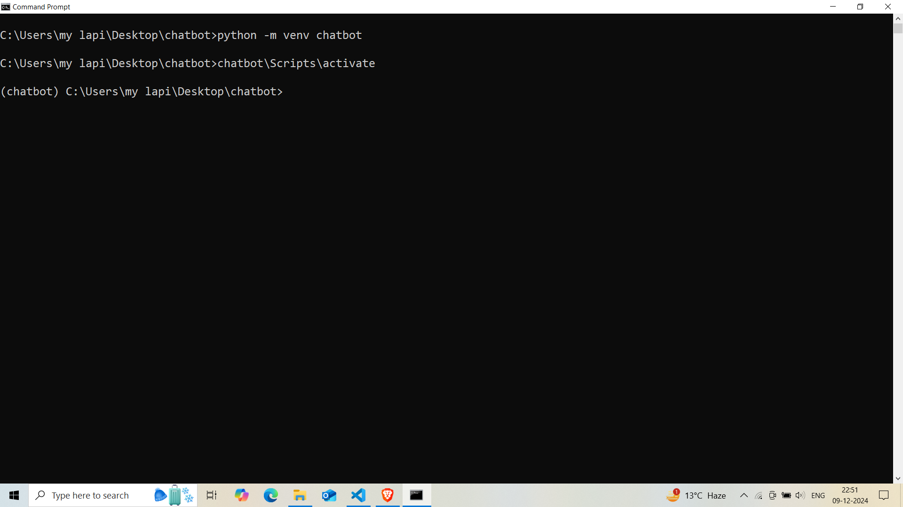
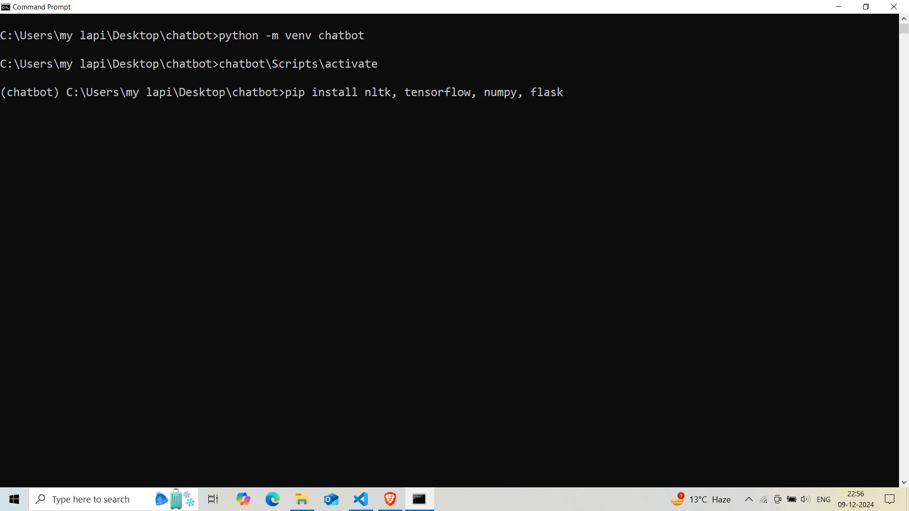
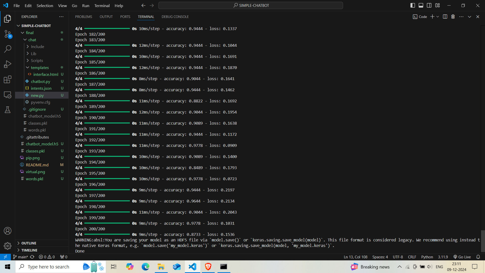
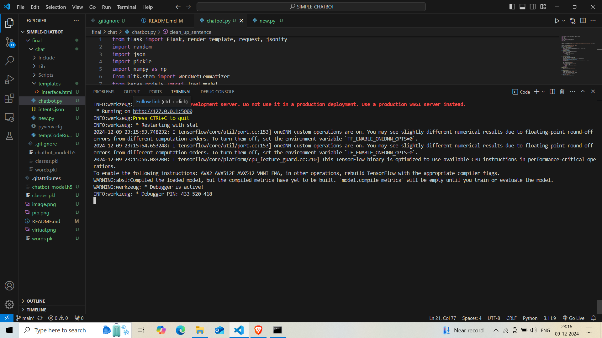
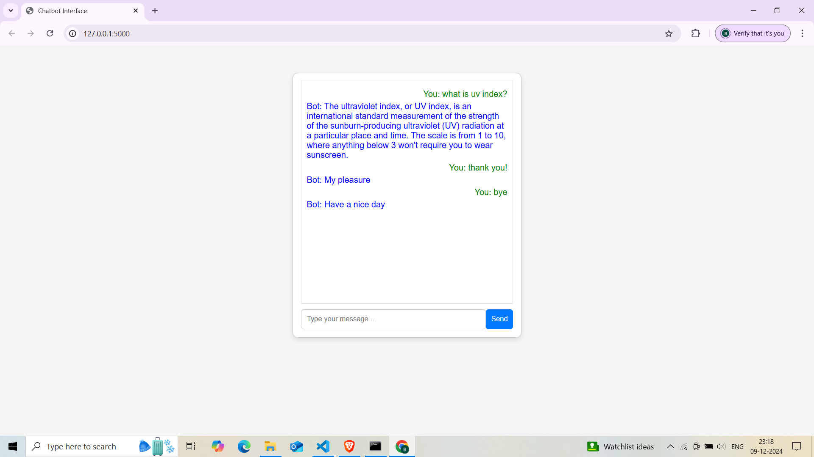

# SIMPLE CHATBOT
 ### A chatbot that uses numpy, tensorflow and nltk libraries to train a very basic neural network (about uv index) to give a web output (based on a html, css, javascript)

## HOW TO INSTALL
### step 1: Step up the virtual environment on your desktop. 
- 1.1 Create a new folder on your desktop 
- 1.2 open the command prompt and specify the path to the above folder
- 1.3 follow the given steps to create and activate a virtual environment within the folder

### step 2: installing the required libraries for the project
2.1 inside the activated virtual environment write the following:- 

2.2 the libraries installed are as follows:-
* numpy
* tensorflow
* nltk
* flask
### step 3: clone the github repository inside the virtual environment using github desktop or https://github.com/git-guides/git-clone
 ### step 4: run the file 'new.py' to train the neural network 

### step 5: now specify the port according to your device in the line 63 of chatbot.py (here we have taken port = 5000, so the link will be generated accordingly)

### step 6: now open the link in your preferred browser and enjoy!

## SCOPE: This chatbot can be customised in many ways, more responses can be added in the intents.json file for a more comprehensive, and specific chatbot. You can also easily integrate API's to make the chatbot more suitable for real-world application. 

